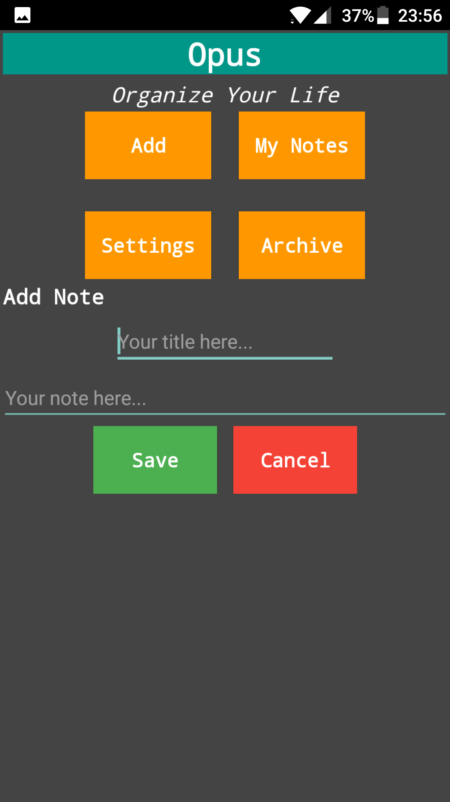
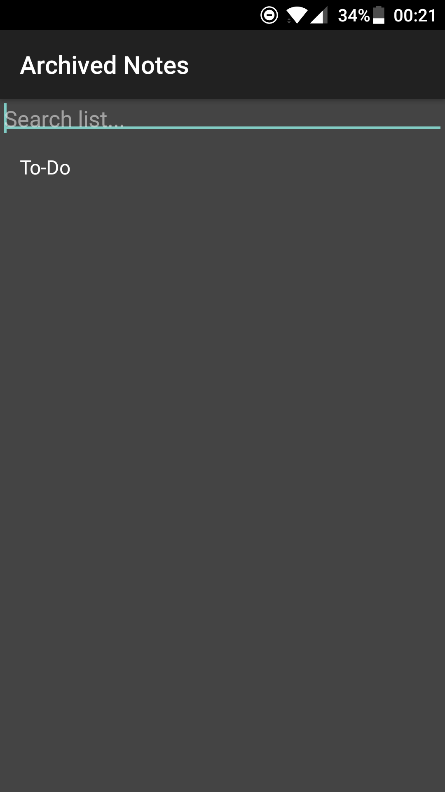

# Welcome to Opus

 

## Get started with Opus

Download and install the Opus APK
- From Dropbox DDL (direct download link).
- Aptoide (aptoide.com).
- Soon Google Play Store.
 
<form action="http://dl.dropboxusercontent.com/s/7rk93wzbqesuzsb/Opus.apk?dl=0">
    <input type="submit" value="Dropbox Download" />
</form>
 
<form action="http://tellspace.store.aptoide.com">
    <input type="submit" value="Aptoide Download" />
</form>
 
Open Opus and click the ***Add*** button. 
Add a title and a note.
Click ***Save*** when you are done.
You have now created your first Opus note, you can acces your notes by clicking on ***My Notes***.
 
 

 
 

 

### Edit a note

To Edit a note simply click the ***My Notes*** button and click on the note you want to edit.
When you are done editing click ***Save***.
 
 

 

### Delete or Mark a Task/Note as done

If you want to delete or mark a note as done simply open the note you want to delete and click on ***Check***. This will move your note for _My Notes_ to the archive were you can acces your lastly deleted or Checket note.
***Warning! The archive only stores the lastly checket note the other ones will be overited in the archive.***
 
 

 

# Features

## Voice input

If you want to quickly make a note you can simply do it using your _voice_. Just longclick the ***Add*** button and follow the instructions.

 

For more details see the <a href="http://doc.opusapp.ml"> Documentation and Help pages </a>
 

## Follow the development process on the Tell Space Blog!

If you want to follow the deveopment process of Opus (and other news and updates for Tell Space) go check out our new blog!
You can find the tell space blog here: <a target="blank" href="http://tellspace.wordpress.com"> tellspace.wordpress.com </a>

 
# About

## Tell Space

Tell Space is a technology development company for more information see <a href="http://tellspace.ml"> Tell Spaces Official Website </a>

# Contact
## Contact
Email: contact@tellspace.ml
 
 
Instagram: <a href="http://www.instagram.com/tellspace/"> @tellspace </a>
 
 
Hashtags: #tellspace, #onyxbash #opusapp
 
 
Github: <a href="https://github.com/TellSpaceOfficial"> TellSpaceOfficial </a>
 
 
 
## Support
### Having problems?
### Read the Docuemtnation,Comment on github, instagram or email us:
Documentation: <a href="http://doc.opusapp.ml"> http://doc.opusapp.ml </a>
 
Email: info@tellspace.ml
 
 
Instagram: <a href="http://www.instagram.com/tellspace/"> @tellspace </a>
 
 
Github: <a href="https://github.com/TellSpaceOfficial"> TellSpaceOfficial </a>
   
## Contact Form
 
 
