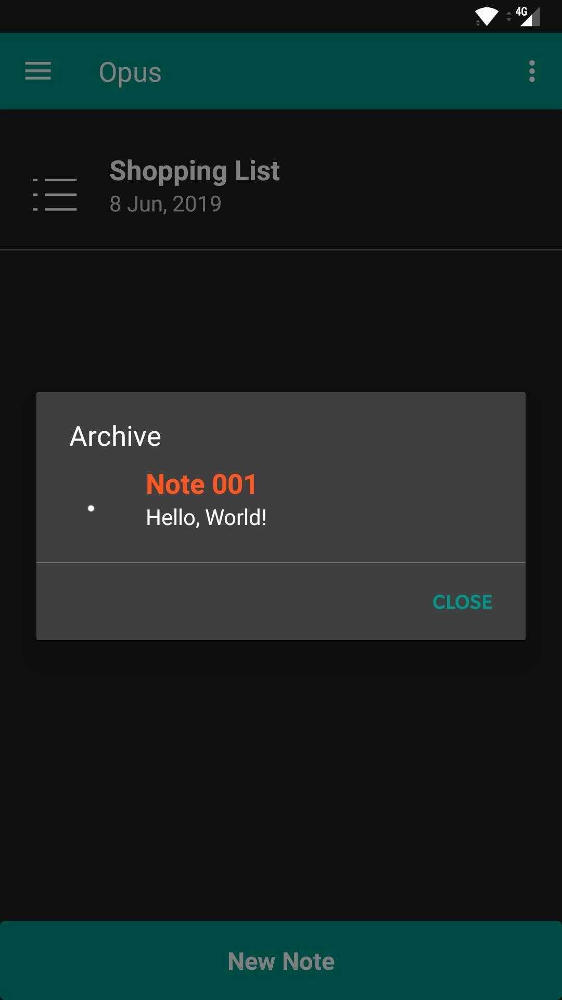

# Welcome to Opus
### If you are on mobile try the 'Add To Homescreen' to get a mobile web-app experience!

 

## Get started with Opus

Download the Opus App From Google Play
 

Open Opus and tap on the ***New Note*** button. 
Add a title and a note.
tap ***Save*** when you are done.
You have now created your first Opus note, you can open & edit your note by tapping on it in the notes list.
 
 

 
 

 

### Edit a note

To Open & Edit a note simply tap the on the note you want to edit, this willl open the note. Then tap on the pencil icon to start editing.
When you are done editing tap ***Save***.
 
 

 
 

 

### Delete or archive a note

If you want to delete or archive a note simply open the note you want to delete/archive and tap on ***Delete*** button. The app will then ask you if you want to delete or archive the note, if you choose to archive the note the app will move the note to the archive were you can acces your lastly archived note.
***Warning! The archive only stores one note at a time, archiving more notes will overwrite the last note.***
You can restore your lastly checked note from the archive by open in the archive from the options menu, tapping on it and selecting _YES_. If you choose to delete the note the app will remove the note from your notes list and ***NOT*** move it to the archive!
 
 

 
 

 

# More

### For more details see the <a href="http://doc.opusapp.ml"> Documentation and Help pages </a>
 

# About

## Gevosoft

Gevosoft is a technology development company for more information see <a href="http://gevosoft.com"> Gevosoft's Official Website </a>

# Contact
## Contact
Email: contact@gevosoft.com
 
 
Instagram: <a href="http://www.instagram.com/gevosoft/"> @gevosoft </a>
 
 
Github: <a href="https://github.com/GevosoftOfficial"> GevosoftOfficial </a>
 
 
 
## Support
### Having problems?
### Read the Documentation,Comment on Github.com, Instagram DM us or email us:
Documentation: <a href="http://doc.opusapp.ml"> http://doc.opusapp.ml </a>
 
Email: contact.gevosoft@gmail.com
 
 
Instagram: <a href="http://www.instagram.com/gevosoft"> @gevosoft </a>
 
 
Github: <a href="https://github.com/GevosoftOfficial"> GevosoftOfficial </a>
   
## Contact
 
 
